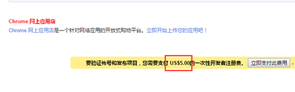

# google-plugin

> 注意目前chrome插件最新版本是3 
>
> 以下学习记录是以2来的 主要参考了小茗同学的[文章](https://www.cnblogs.com/liuxianan/p/chrome-plugin-develop.html)

# 前言

增强浏览器功能，轻松实现属于自己的“定制版”浏览器，等等。

Chrome插件提供了很多实用API供我们使用，包括但不限于：

- 书签控制；
- 下载控制；
- 窗口控制；
- 标签控制；
- 网络请求控制，各类事件监听；
- 自定义原生菜单；
- 完善的通信机制；
- 等等；

> 涉及permissions字段的更新都需要移除插件才会生效，其他页面上的改动好像开启关闭插件就可以生效了。

# 核心

## 常常鲜

- 创建一个`manifest.json`文件与`popup.html`文件，新建`images`文件夹存放图标

  ```json
  {
      "name": "hello-world-plugin",
      "description" : "hello-world-plugin",
      "version": "1.0",
      "manifest_version": 2,
      "browser_action": {
          "default_icon": "img/icon.png",
          "default_title": "这是一个Chrome插件demo",
          "default_popup": "popup.html"
      },
  }
  ```

  ```html
  // popup.html
  <!DOCTYPE html>
  <html lang="en">
  
  <head>
      <meta charset="UTF-8">
      <meta http-equiv="X-UA-Compatible" content="IE=edge">
      <meta name="viewport" content="width=device-width, initial-scale=1.0">
      <title>测试</title>
  </head>
  
  <body class="bgs">
      <div class="switch">
          <input id="btn" type="button" value="点击测试" />
          <div id="value">
          </div>
      </div>
      <div id="container"></div>
  </body>
  
  </html>
  ```

- 整体目录

  ```
  ├─manifest.json
  ├─popup.html
  ├─img
  │   icon.png
  ```
  
- 然后就是导入到浏览器中看看效果了

  - 打开设置>扩展程序>开启开发者模式(右上角)>加载已解压的扩展程序>选择我们的项目文件夹项目
  - 成功就可以在浏览器右上角看到图标了

## manifest.json

这是一个Chrome插件最重要也是必不可少的文件，用来配置所有和插件相关的配置，必须放在根目录。其中，`manifest_version`、`name`、`version`3个是必不可少的，`description`和`icons`是推荐的。

完整配置参考[chrome插件官网v2](https://developer.chrome.com/docs/extensions/mv2/manifest/)

```json
{
	// 清单文件的版本，这个必须写，而且必须是2
	"manifest_version": 2,
	// 插件的名称
	"name": "demo",
	// 插件的版本
	"version": "1.0.0",
	// 插件描述
	"description": "简单的Chrome扩展demo",
	// 图标，一般偷懒全部用一个尺寸的也没问题
	"icons":
	{
		"16": "img/icon.png",
		"48": "img/icon.png",
		"128": "img/icon.png"
	},
	// 会一直常驻的后台JS或后台页面
	"background":
	{
		// 2种指定方式，如果指定JS，那么会自动生成一个背景页
		"page": "background.html"
		//"scripts": ["js/background.js"]
	},
	// 浏览器右上角图标设置，browser_action、page_action、app必须三选一
	"browser_action": 
	{
		"default_icon": "img/icon.png",
		// 图标悬停时的标题，可选
		"default_title": "这是一个示例Chrome插件",
		"default_popup": "popup.html"
	},
	// 当某些特定页面打开才显示的图标
	/*"page_action":
	{
		"default_icon": "img/icon.png",
		"default_title": "我是pageAction",
		"default_popup": "popup.html"
	},*/
	// 需要直接注入页面的JS
	"content_scripts": 
	[
		{
			//"matches": ["http://*/*", "https://*/*"],
			// "<all_urls>" 表示匹配所有地址
			"matches": ["<all_urls>"],
			// 多个JS按顺序注入
			"js": ["js/jquery-1.8.3.js", "js/content-script.js"],
			// JS的注入可以随便一点，但是CSS的注意就要千万小心了，因为一不小心就可能影响全局样式
			"css": ["css/custom.css"],
			// 代码注入的时间，可选值： "document_start", "document_end", or "document_idle"，最后一个表示页面空闲时，默认document_idle
			"run_at": "document_start"
		},
		// 这里仅仅是为了演示content-script可以配置多个规则
		{
			"matches": ["*://*/*.png", "*://*/*.jpg", "*://*/*.gif", "*://*/*.bmp"],
			"js": ["js/show-image-content-size.js"]
		}
	],
	// 权限申请
	"permissions":
	[
		"contextMenus", // 右键菜单
		"tabs", // 标签
		"notifications", // 通知
		"webRequest", // web请求
		"webRequestBlocking",
		"storage", // 插件本地存储
		"http://*/*", // 可以通过executeScript或者insertCSS访问的网站
		"https://*/*" // 可以通过executeScript或者insertCSS访问的网站
	],
	// 普通页面能够直接访问的插件资源列表，如果不设置是无法直接访问的
	"web_accessible_resources": ["js/inject.js"],
	// 插件主页，这个很重要，不要浪费了这个免费广告位
	"homepage_url": "https://www.baidu.com",
	// 覆盖浏览器默认页面
	"chrome_url_overrides":
	{
		// 覆盖浏览器默认的新标签页
		"newtab": "newtab.html"
	},
	// Chrome40以前的插件配置页写法
	"options_page": "options.html",
	// Chrome40以后的插件配置页写法，如果2个都写，新版Chrome只认后面这一个
	"options_ui":
	{
		"page": "options.html",
		// 添加一些默认的样式，推荐使用
		"chrome_style": true
	},
	// 向地址栏注册一个关键字以提供搜索建议，只能设置一个关键字
	"omnibox": { "keyword" : "go" },
	// 默认语言
	"default_locale": "zh_CN",
	// devtools页面入口，注意只能指向一个HTML文件，不能是JS文件
	"devtools_page": "devtools.html"
}
```

## content-scripts

所谓[content-scripts](https://developer.chrome.com/extensions/content_scripts)，其实就是Chrome插件中向页面注入脚本的一种形式（虽然名为script，其实还可以包括css的），借助`content-scripts`我们可以实现通过配置的方式轻松向指定页面注入JS和CSS（如果需要动态注入，可以参考下文），最常见的比如：广告屏蔽、页面CSS定制，等等。

```
{
	// 需要直接注入页面的JS
	"content_scripts": 
	[
		{
			//"matches": ["http://*/*", "https://*/*"],
			// "<all_urls>" 表示匹配所有地址
			"matches": ["<all_urls>"],
			// 多个JS按顺序注入
			"js": ["js/jquery-1.8.3.js", "js/content-script.js"],
			// JS的注入可以随便一点，但是CSS的注意就要千万小心了，因为一不小心就可能影响全局样式
			"css": ["css/custom.css"],
			// 代码注入的时间，可选值： "document_start", "document_end", or "document_idle"，最后一个表示页面空闲时，默认document_idle
			"run_at": "document_start"
		}
	],
}
```

特别注意，如果没有主动指定`run_at`为`document_start`（默认为`document_idle`），下面这种代码是不会生效的：

```javascript
document.addEventListener('DOMContentLoaded', function()
{
	console.log('我被执行了！');
});
```

`content-scripts`和原始页面共享DOM，但是不共享JS，如要访问页面JS（例如某个JS变量），只能通过`injected js`来实现。`content-scripts`不能访问绝大部分`chrome.xxx.api`，除了下面这4种：

- chrome.extension(getURL , inIncognitoContext , lastError , onRequest , sendRequest)
- chrome.i18n
- chrome.runtime(connect , getManifest , getURL , id , onConnect , onMessage , sendMessage)
- chrome.storage

其实看到这里不要悲观，这些API绝大部分时候都够用了，非要调用其它API的话，你还可以通过通信来实现让background来帮你调用（关于通信，后文有详细介绍）。

## injected-script

这里的`injected-script`是我给它取的，指的是通过DOM操作的方式向页面注入的一种JS。为什么要把这种JS单独拿出来讨论呢？又或者说为什么需要通过这种方式注入JS呢？

这是因为`content-script`有一个很大的“缺陷”，也就是无法访问页面中的JS，虽然它可以操作DOM，但是DOM却不能调用它，也就是无法在DOM中通过绑定事件的方式调用`content-script`中的代码（包括直接写`onclick`和`addEventListener`2种方式都不行），但是，“在页面上添加一个按钮并调用插件的扩展API”是一个很常见的需求，那该怎么办呢？其实这就是本小节要讲的。

在`content-script`中通过DOM方式向页面注入`inject-script`代码示例：

```javascript
// 向页面注入JS
function injectCustomJs(jsPath)
{
	jsPath = jsPath || 'js/inject.js';
	var temp = document.createElement('script');
	temp.setAttribute('type', 'text/javascript');
	// 获得的地址类似：chrome-extension://ihcokhadfjfchaeagdoclpnjdiokfakg/js/inject.js
	temp.src = chrome.extension.getURL(jsPath);
	temp.onload = function()
	{
		// 放在页面不好看，执行完后移除掉
		this.parentNode.removeChild(this);
	};
	document.head.appendChild(temp);
}
```

你以为这样就行了？执行一下你会看到如下报错：

```mipsasm
Denying load of chrome-extension://efbllncjkjiijkppagepehoekjojdclc/js/inject.js. Resources must be listed in the web_accessible_resources manifest key in order to be loaded by pages outside the extension.
```

意思就是你想要在web中直接访问插件中的资源的话必须显示声明才行，配置文件中增加如下：

```javascript
{
	// 普通页面能够直接访问的插件资源列表，如果不设置是无法直接访问的
	"web_accessible_resources": ["js/inject.js"],
}
```

至于`inject-script`如何调用`content-script`中的代码，后面我会在专门的一个消息通信章节详细介绍。

## background

后台（姑且这么翻译吧），是一个常驻的页面，它的生命周期是插件中所有类型页面中最长的，它随着浏览器的打开而打开，随着浏览器的关闭而关闭，所以通常把需要一直运行的、启动就运行的、全局的代码放在background里面。

background的权限非常高，几乎可以调用所有的Chrome扩展API（除了devtools），而且它可以无限制跨域，也就是可以跨域访问任何网站而无需要求对方设置`CORS`。

> 经过测试，其实不止是background，所有的直接通过`chrome-extension://id/xx.html`这种方式打开的网页都可以无限制跨域。

配置中，`background`可以通过`page`指定一张网页，也可以通过`scripts`直接指定一个JS，Chrome会自动为这个JS生成一个默认的网页：

```javascript
{
	// 会一直常驻的后台JS或后台页面
	"background":
	{
		// 2种指定方式，如果指定JS，那么会自动生成一个背景页
		"page": "background.html"
		//"scripts": ["js/background.js"]
	},
}
```

需要特别说明的是，虽然你可以通过`chrome-extension://xxx/background.html`直接打开后台页，但是你打开的后台页和真正一直在后台运行的那个页面不是同一个，换句话说，你可以打开无数个`background.html`，但是真正在后台常驻的只有一个，而且这个你永远看不到它的界面，只能调试它的代码。

## event-pages

这里顺带介绍一下[event-pages](https://developer.chrome.com/extensions/event_pages)，它是一个什么东西呢？鉴于background生命周期太长，长时间挂载后台可能会影响性能，所以Google又弄一个`event-pages`，在配置文件上，它与background的唯一区别就是多了一个`persistent`参数：

```javascript
{
	"background":
	{
		"scripts": ["event-page.js"],
		"persistent": false
	},
}
```

它的生命周期是：在被需要时加载，在空闲时被关闭，什么叫被需要时呢？比如第一次安装、插件更新、有content-script向它发送消息，等等。

除了配置文件的变化，代码上也有一些细微变化，个人这个简单了解一下就行了，一般情况下background也不会很消耗性能的。

## popup

`popup`是点击`browser_action`或者`page_action`图标时打开的一个小窗口网页，焦点离开网页就立即关闭，一般用来做一些临时性的交互。


`popup`可以包含任意你想要的HTML内容，并且会自适应大小。可以通过`default_popup`字段来指定popup页面，也可以调用`setPopup()`方法。

配置方式：

```javascript
{
	"browser_action":
	{
		"default_icon": "img/icon.png",
		// 图标悬停时的标题，可选
		"default_title": "这是一个示例Chrome插件",
		"default_popup": "popup.html"
	}
}
```

需要特别注意的是，由于单击图标打开popup，焦点离开又立即关闭，所以popup页面的生命周期一般很短，需要长时间运行的代码千万不要写在popup里面。

在权限上，它和background非常类似，它们之间最大的不同是生命周期的不同，popup中可以直接通过`chrome.extension.getBackgroundPage()`获取background的window对象。

## homepage_url

开发者或者插件主页设置


## browserAction(浏览器右上角)

通过配置`browser_action`可以在浏览器的右上角增加一个图标，一个`browser_action`可以拥有一个图标，一个`tooltip`，一个`badge`和一个`popup`。

示例配置如下：

```json
"browser_action":
{
	"default_icon": "img/icon.png",
	"default_title": "这是一个示例Chrome插件",
	"default_popup": "popup.html"
}
```

### 图标

`browser_action`图标推荐使用宽高都为19像素的图片，更大的图标会被缩小，格式随意，一般推荐png，可以通过manifest中`default_icon`字段配置，也可以调用`setIcon()`方法。

### tooltip

修改`browser_action`的manifest中`default_title`字段，或者调用`setTitle()`方法。

### badge

所谓`badge`就是在图标上显示一些文本，可以用来更新一些小的扩展状态提示信息。因为badge空间有限，所以只支持4个以下的字符（英文4个，中文2个）。badge无法通过配置文件来指定，必须通过代码实现，设置badge文字和颜色可以分别使用`setBadgeText()`和`setBadgeBackgroundColor()`。

```javascript
chrome.browserAction.setBadgeText({text: 'new'});
chrome.browserAction.setBadgeBackgroundColor({color: [255, 0, 0, 255]});
```

## pageAction(地址栏右侧)(无效了)

所谓`pageAction`，指的是只有当某些特定页面打开才显示的图标，它和`browserAction`最大的区别是一个始终都显示，一个只在特定情况才显示。

需要特别说明的是早些版本的Chrome是将pageAction放在地址栏的最右边，左键单击弹出popup，右键单击则弹出相关默认的选项菜单：

而新版的Chrome更改了这一策略，pageAction和普通的browserAction一样也是放在浏览器右上角，只不过没有点亮时是灰色的，点亮了才是彩色的，灰色时无论左键还是右键单击都是弹出选项：

> 2023/02/12 chrome109.0.5414.121 已经没得效果了

调整之后的`pageAction`我们可以简单地把它看成是可以置灰的`browserAction`。

- chrome.pageAction.show(tabId) 显示图标；
- chrome.pageAction.hide(tabId) 隐藏图标；

示例(只有打开百度才显示图标)：

```javascript
// manifest.json
{
	"page_action":
	{
		"default_icon": "img/icon.png",
		"default_title": "我是pageAction",
		"default_popup": "popup.html"
	},
	"permissions": ["declarativeContent"]
}

// background.js
chrome.runtime.onInstalled.addListener(function(){
	chrome.declarativeContent.onPageChanged.removeRules(undefined, function(){
		chrome.declarativeContent.onPageChanged.addRules([
			{
				conditions: [
					// 只有打开百度才显示pageAction
					new chrome.declarativeContent.PageStateMatcher({pageUrl: {urlContains: 'baidu.com'}})
				],
				actions: [new chrome.declarativeContent.ShowPageAction()]
			}
		]);
	});
});
```


## 右键菜单

通过开发Chrome插件可以自定义浏览器的右键菜单，主要是通过`chrome.contextMenus`API实现，右键菜单可以出现在不同的上下文，比如普通页面、选中的文字、图片、链接，等等，如果有同一个插件里面定义了多个菜单，Chrome会自动组合放到以插件名字命名的二级菜单里，如下：


# 5种类型的JS对比

Chrome插件的JS主要可以分为这5类：`injected script`、`content-script`、`popup js`、`background js`和`devtools js`，

## 6.1. 权限对比

| JS种类          | 可访问的API                                    | DOM访问情况  | JS访问情况 | 直接跨域 |
| --------------- | ---------------------------------------------- | ------------ | ---------- | -------- |
| injected script | 和普通JS无任何差别，不能访问任何扩展API        | 可以访问     | 可以访问   | 不可以   |
| content script  | 只能访问 extension、runtime等部分API           | 可以访问     | 不可以     | 不可以   |
| popup js        | 可访问绝大部分API，除了devtools系列            | 不可直接访问 | 不可以     | 可以     |
| background js   | 可访问绝大部分API，除了devtools系列            | 不可直接访问 | 不可以     | 可以     |
| devtools js     | 只能访问 devtools、extension、runtime等部分API | 可以         | 可以       | 不可以   |

## 6.2. 调试方式对比

| JS类型          | 调试方式                 | 图片说明                                               |
| --------------- | ------------------------ | ------------------------------------------------------ |
| injected script | 直接普通的F12即可        | 懒得截图                                               |
| content-script  | 打开Console,如图切换     |  |
| popup-js        | popup页面右键审查元素    |   |
| background      | 插件管理页点击背景页即可 |   |
| devtools-js     | 暂未找到有效方法         |                                                        |

# 消息通信

通信主页：https://developer.chrome.com/extensions/messaging

前面我们介绍了Chrome插件中存在的5种JS，那么它们之间如何互相通信呢？下面先来系统概况一下，然后再分类细说。需要知道的是，popup和background其实几乎可以视为一种东西，因为它们可访问的API都一样、通信机制一样、都可以跨域。

## 7.1. 互相通信概览

注：`-`表示不存在或者无意义，或者待验证。

|                 | injected-script                       | content-script                              | popup-js                                          | background-js                                     |
| --------------- | ------------------------------------- | ------------------------------------------- | ------------------------------------------------- | ------------------------------------------------- |
| injected-script | -                                     | window.postMessage                          | -                                                 | -                                                 |
| content-script  | window.postMessage                    | -                                           | chrome.runtime.sendMessage chrome.runtime.connect | chrome.runtime.sendMessage chrome.runtime.connect |
| popup-js        | -                                     | chrome.tabs.sendMessage chrome.tabs.connect | -                                                 | chrome.extension. getBackgroundPage()             |
| background-js   | -                                     | chrome.tabs.sendMessage chrome.tabs.connect | chrome.extension.getViews                         | -                                                 |
| devtools-js     | chrome.devtools. inspectedWindow.eval | -                                           | chrome.runtime.sendMessage                        | chrome.runtime.sendMessage                        |

## 7.2. 通信详细介绍

### 7.2.1. popup和background

popup可以直接调用background中的JS方法，也可以直接访问background的DOM：

```javascript
// background.js
function test()
{
	alert('我是background！');
}

// popup.js
var bg = chrome.extension.getBackgroundPage();
bg.test(); // 访问bg的函数
alert(bg.document.body.innerHTML); // 访问bg的DOM
```

> 小插曲，今天碰到一个情况，发现popup无法获取background的任何方法，找了半天才发现是因为background的js报错了，而你如果不主动查看background的js的话，是看不到错误信息的，特此提醒。

至于`background`访问`popup`如下（前提是`popup`已经打开）：

```javascript
var views = chrome.extension.getViews({type:'popup'});
if(views.length > 0) {
	console.log(views[0].location.href);
}
```

### 7.2.2. popup或者bg向content主动发送消息

background.js或者popup.js：

```javascript
function sendMessageToContentScript(message, callback)
{
	chrome.tabs.query({active: true, currentWindow: true}, function(tabs)
	{
		chrome.tabs.sendMessage(tabs[0].id, message, function(response)
		{
			if(callback) callback(response);
		});
	});
}
sendMessageToContentScript({cmd:'test', value:'你好，我是popup！'}, function(response)
{
	console.log('来自content的回复：'+response);
});
```

`content-script.js`接收：

```javascript
chrome.runtime.onMessage.addListener(function(request, sender, sendResponse)
{
	// console.log(sender.tab ?"from a content script:" + sender.tab.url :"from the extension");
	if(request.cmd == 'test') alert(request.value);
	sendResponse('我收到了你的消息！');
});
```

双方通信直接发送的都是JSON对象，不是JSON字符串，所以无需解析，很方便（当然也可以直接发送字符串）。

> 网上有些老代码中用的是`chrome.extension.onMessage`，没有完全查清二者的区别(貌似是别名)，但是建议统一使用`chrome.runtime.onMessage`。

### 7.2.3. content-script主动发消息给后台

content-script.js：

```javascript
chrome.runtime.sendMessage({greeting: '你好，我是content-script呀，我主动发消息给后台！'}, function(response) {
	console.log('收到来自后台的回复：' + response);
});
```

background.js 或者 popup.js：

```javascript
// 监听来自content-script的消息
chrome.runtime.onMessage.addListener(function(request, sender, sendResponse)
{
	console.log('收到来自content-script的消息：');
	console.log(request, sender, sendResponse);
	sendResponse('我是后台，我已收到你的消息：' + JSON.stringify(request));
});
```

注意事项：

- content_scripts向`popup`主动发消息的前提是popup必须打开！否则需要利用background作中转；
- 如果background和popup同时监听，那么它们都可以同时收到消息，但是只有一个可以sendResponse，一个先发送了，那么另外一个再发送就无效；

### 7.2.4. injected script和content-script

`content-script`和页面内的脚本（`injected-script`自然也属于页面内的脚本）之间唯一共享的东西就是页面的DOM元素，有2种方法可以实现二者通讯：

1. 可以通过`window.postMessage`和`window.addEventListener`来实现二者消息通讯；
2. 通过自定义DOM事件来实现；

第一种方法（推荐）：

`injected-script`中：

```javascript
window.postMessage({"test": '你好！'}, '*');
```

content script中：

```javascript
window.addEventListener("message", function(e)
{
	console.log(e.data);
}, false);
```

第二种方法：

`injected-script`中：

```javascript
var customEvent = document.createEvent('Event');
customEvent.initEvent('myCustomEvent', true, true);
function fireCustomEvent(data) {
	hiddenDiv = document.getElementById('myCustomEventDiv');
	hiddenDiv.innerText = data
	hiddenDiv.dispatchEvent(customEvent);
}
fireCustomEvent('你好，我是普通JS！');
```

`content-script.js`中：

```javascript
var hiddenDiv = document.getElementById('myCustomEventDiv');
if(!hiddenDiv) {
	hiddenDiv = document.createElement('div');
	hiddenDiv.style.display = 'none';
	document.body.appendChild(hiddenDiv);
}
hiddenDiv.addEventListener('myCustomEvent', function() {
	var eventData = document.getElementById('myCustomEventDiv').innerText;
	console.log('收到自定义事件消息：' + eventData);
});
```

## 7.3. 长连接和短连接

其实上面已经涉及到了，这里再单独说明一下。Chrome插件中有2种通信方式，一个是短连接（`chrome.tabs.sendMessage`和`chrome.runtime.sendMessage`），一个是长连接（`chrome.tabs.connect`和`chrome.runtime.connect`）。

短连接的话就是挤牙膏一样，我发送一下，你收到了再回复一下，如果对方不回复，你只能重新发，而长连接类似`WebSocket`会一直建立连接，双方可以随时互发消息。

短连接上面已经有代码示例了，这里只讲一下长连接。

popup.js：

```javascript
getCurrentTabId((tabId) => {
	var port = chrome.tabs.connect(tabId, {name: 'test-connect'});
	port.postMessage({question: '你是谁啊？'});
	port.onMessage.addListener(function(msg) {
		alert('收到消息：'+msg.answer);
		if(msg.answer && msg.answer.startsWith('我是'))
		{
			port.postMessage({question: '哦，原来是你啊！'});
		}
	});
});
```

content-script.js：

```javascript
// 监听长连接
chrome.runtime.onConnect.addListener(function(port) {
	console.log(port);
	if(port.name == 'test-connect') {
		port.onMessage.addListener(function(msg) {
			console.log('收到长连接消息：', msg);
			if(msg.question == '你是谁啊？') port.postMessage({answer: '我是你爸！'});
		});
	}
});
```

# 其它补充

## 8.1. 动态注入或执行JS

虽然在`background`和`popup`中无法直接访问页面DOM，但是可以通过`chrome.tabs.executeScript`来执行脚本，从而实现访问web页面的DOM（注意，这种方式也不能直接访问页面JS）。

示例`manifest.json`配置：

```javascript
{
	"name": "动态JS注入演示",
	...
	"permissions": [
		"tabs", "http://*/*", "https://*/*"
	],
	...
}
```

JS：

```javascript
// 动态执行JS代码
chrome.tabs.executeScript(tabId, {code: 'document.body.style.backgroundColor="red"'});
// 动态执行JS文件
chrome.tabs.executeScript(tabId, {file: 'some-script.js'});
```

## 8.2. 动态注入CSS

示例`manifest.json`配置：

```javascript
{
	"name": "动态CSS注入演示",
	...
	"permissions": [
		"tabs", "http://*/*", "https://*/*"
	],
	...
}
```

JS代码：

```javascript
// 动态执行CSS代码，TODO，这里有待验证
chrome.tabs.insertCSS(tabId, {code: 'xxx'});
// 动态执行CSS文件
chrome.tabs.insertCSS(tabId, {file: 'some-style.css'});
```

## 8.3. 获取当前窗口ID

```javascript
chrome.windows.getCurrent(function(currentWindow)
{
	console.log('当前窗口ID：' + currentWindow.id);
});
```

## 8.4. 获取当前标签页ID

一般有2种方法：

```javascript
// 获取当前选项卡ID
function getCurrentTabId(callback)
{
	chrome.tabs.query({active: true, currentWindow: true}, function(tabs)
	{
		if(callback) callback(tabs.length ? tabs[0].id: null);
	});
}
```

获取当前选项卡id的另一种方法，大部分时候都类似，只有少部分时候会不一样（例如当窗口最小化时）

```javascript
// 获取当前选项卡ID
function getCurrentTabId2()
{
	chrome.windows.getCurrent(function(currentWindow)
	{
		chrome.tabs.query({active: true, windowId: currentWindow.id}, function(tabs)
		{
			if(callback) callback(tabs.length ? tabs[0].id: null);
		});
	});
}
```

## 8.5. 本地存储

本地存储建议用`chrome.storage`而不是普通的`localStorage`，区别有好几点，个人认为最重要的2点区别是：

- `chrome.storage`是针对插件全局的，即使你在`background`中保存的数据，在`content-script`也能获取到；
- `chrome.storage.sync`可以跟随当前登录用户自动同步，这台电脑修改的设置会自动同步到其它电脑，很方便，如果没有登录或者未联网则先保存到本地，等登录了再同步至网络；

需要声明`storage`权限，有`chrome.storage.sync`和`chrome.storage.local`2种方式可供选择，使用示例如下：

```javascript
// 读取数据，第一个参数是指定要读取的key以及设置默认值
chrome.storage.sync.get({color: 'red', age: 18}, function(items) {
	console.log(items.color, items.age);
});
// 保存数据
chrome.storage.sync.set({color: 'blue'}, function() {
	console.log('保存成功！');
});
```

## 8.6. webRequest

通过webRequest系列API可以对HTTP请求进行任性地修改、定制，这里通过`beforeRequest`来简单演示一下它的冰山一角：

```javascript
//manifest.json
{
	// 权限申请
	"permissions":
	[
		"webRequest", // web请求
		"webRequestBlocking", // 阻塞式web请求
		"storage", // 插件本地存储
		"http://*/*", // 可以通过executeScript或者insertCSS访问的网站
		"https://*/*" // 可以通过executeScript或者insertCSS访问的网站
	],
}


// background.js
// 是否显示图片
var showImage;
chrome.storage.sync.get({showImage: true}, function(items) {
	showImage = items.showImage;
});
// web请求监听，最后一个参数表示阻塞式，需单独声明权限：webRequestBlocking
chrome.webRequest.onBeforeRequest.addListener(details => {
	// cancel 表示取消本次请求
	if(!showImage && details.type == 'image') return {cancel: true};
	// 简单的音视频检测
	// 大部分网站视频的type并不是media，且视频做了防下载处理，所以这里仅仅是为了演示效果，无实际意义
	if(details.type == 'media') {
		chrome.notifications.create(null, {
			type: 'basic',
			iconUrl: 'img/icon.png',
			title: '检测到音视频',
			message: '音视频地址：' + details.url,
		});
	}
}, {urls: ["<all_urls>"]}, ["blocking"]);
```

## 8.7. 国际化

插件根目录新建一个名为`_locales`的文件夹，再在下面新建一些语言的文件夹，如`en`、`zh_CN`、`zh_TW`，然后再在每个文件夹放入一个`messages.json`，同时必须在清单文件中设置`default_locale`。

`_locales\en\messages.json`内容：

```javascript
{
	"pluginDesc": {"message": "A simple chrome extension demo"},
	"helloWorld": {"message": "Hello World!"}
}
```

`_locales\zh_CN\messages.json`内容：

```javascript
{
	"pluginDesc": {"message": "一个简单的Chrome插件demo"},
	"helloWorld": {"message": "你好啊，世界！"}
}
```

在`manifest.json`和`CSS`文件中通过`__MSG_messagename__`引入，如：

```javascript
{
	"description": "__MSG_pluginDesc__",
	// 默认语言
	"default_locale": "zh_CN",
}
```

JS中则直接`chrome.i18n.getMessage("helloWorld")`。

测试时，通过给chrome建立一个不同的快捷方式`chrome.exe --lang=en`来切换语言，如：


英文效果：


中文效果：


## 8.8. API总结

比较常用用的一些API系列：

- chrome.tabs
- chrome.runtime
- chrome.webRequest
- chrome.window
- chrome.storage
- chrome.contextMenus
- chrome.devtools
- chrome.extension

# 经验总结

## 9.1. 查看已安装插件路径

已安装的插件源码路径：`C:\Users\用户名\AppData\Local\Google\Chrome\User Data\Default\Extensions`，每一个插件被放在以插件ID为名的文件夹里面，想要学习某个插件的某个功能是如何实现的，看人家的源码是最好的方法了：


如何查看某个插件的ID？进入 chrome://extensions ，然后勾线开发者模式即可看到了。


## 9.2. 特别注意background的报错

很多时候你发现你的代码会莫名其妙的失效，找来找去又找不到原因，这时打开background的控制台才发现原来某个地方写错了导致代码没生效，正式由于background报错的隐蔽性(需要主动打开对应的控制台才能看到错误)，所以特别注意这点。

## 9.3. 如何让popup页面不关闭

在对popup页面审查元素的时候popup会被强制打开无法关闭，只有控制台关闭了才可以关闭popup，原因很简单：如果popup关闭了控制台就没用了。这种方法在某些情况下很实用！

## 9.4. 不支持内联JavaScript的执行

也就是不支持将js直接写在html中，比如：

```html
<input id="btn" type="button" value="收藏" onclick="test()"/>
```

报错如下：

```kotlin
Refused to execute inline event handler because it violates the following Content Security Policy directive: "script-src 'self' blob: filesystem: chrome-extension-resource:". Either the 'unsafe-inline' keyword, a hash ('sha256-...'), or a nonce ('nonce-...') is required to enable inline execution.
```

解决方法就是用JS绑定事件：

```javascript
$('#btn').on('click', function(){alert('测试')});
```

另外，对于A标签，这样写`href="javascript:;"`然后用JS绑定事件虽然控制台会报错，但是不受影响，当然强迫症患者受不了的话只能写成`href="#"`了。

如果这样写：

```bash
<a href="javascript:;" id="get_secret">请求secret</a>
```

报错如下：

```vhdl
Refused to execute JavaScript URL because it violates the following Content Security Policy directive: "script-src 'self' blob: filesystem: chrome-extension-resource:". Either the 'unsafe-inline' keyword, a hash ('sha256-...'), or a nonce ('nonce-...') is required to enable inline execution.
```

## 9.5. 注入CSS的时候必须小心

由于通过`content_scripts`注入的CSS优先级非常高，几乎仅次于浏览器默认样式，稍不注意可能就会影响一些网站的展示效果，所以尽量不要写一些影响全局的样式。

之所以强调这个，是因为这个带来的问题非常隐蔽，不太容易找到，可能你正在写某个网页，昨天样式还是好好的，怎么今天就突然不行了？然后你辛辛苦苦找来找去，找了半天才发现竟然是因为插件里面的一个样式影响的！


# 打包与发布

打包的话直接在插件管理页有一个打包按钮：


然后会生成一个`.crx`文件，要发布到Google应用商店的话需要先登录你的Google账号，然后花5个$注册为开发者，本人太穷，就懒得亲自验证了，有发布需求的自己去整吧。




# 操作书签


# 获取cookie

```json
{
  "permissions": [
  	"tabs",
    "cookies",
    "http://*/*", 
    "https://*/*"
  ]
}
```

获取当前页面url，利用tabs

```js
document.addEventListener('DOMContentLoaded', ()=> {
  chrome.tabs.query({'active': true, 'windowId': chrome.windows.WINDOW_ID_CURRENT},
    function(tabs){
      const url = new URL(tabs[0].url)
      chrome.cookies.getAll({
        domain: url.host
      }, (cookies) => {
        console.log(cookie)
      })
    }
  );
})
```

参考：[Chrome小插件开发 - 获取网站cookies](https://juejin.cn/post/6871679202995896327)

[chrome-extension-cookie 一键搞定 cookie 跨域访问](https://www.jianshu.com/p/1b9639506728)


# V3版本

- **manifest_version**: 插件版本

目前只支持上架和更新 v3 版本，v2 不再支持，必须在 2023 年前全部替换。且 V3 版的上架审核优先级更高，周期更短。

# chrome插件模板

> TODO

- 注入到页面的组件应该使用 WebComponent，这是这样就能做到与宿主页面的样式隔离，并且也不需用字符串拼组件代码
  参考：https://github.com/molvqingtai/yapi-interface-extension


# 其他

### 定时打开网页 并点击网页特定按钮

#### 定时打开

- window下任务计划

  - https://blog.csdn.net/AddisonDing/article/details/111429414

- bat脚本

  ```bash
  @title 开启浏览器Chrome
  @color 0a
  ping  127.0.0.1  -n 5
  @echo 准备打开浏览器
  @echo off
  cd /d C:\Users\Administrator\AppData\Local\Google\Chrome\Application
  start chrome.exe https://www.ygbks.com
  @ping -n 150 127.0.0.1>nul
  @echo 关闭浏览器
  taskkill /F /IM chrome.exe
  @timeout /t 10 /nobreak
  ```

  - http://www.ygbks.com/1824.html
  - https://blog.csdn.net/single_0910/article/details/120759796

#### 点击网页特定按钮

> 跨域网页无法操作 理由很简单 在A页面操作B页面的数据会有很大的安全漏洞

- chrome脚本
  - http://blog.haoji.me/chrome-plugin-develop.html
  - https://blog.csdn.net/foryouslgme/article/details/104362876
- 自动化测试

# 参考

- [【干货】Chrome插件(扩展)开发全攻略 ](https://www.cnblogs.com/liuxianan/p/chrome-plugin-develop.html)
- [最新版 V3 chrome 插件开发~ demo + 坑](https://juejin.cn/post/7021072232461893639)
- [从零深入Chrome插件开发](https://xieyufei.com/2021/11/09/Chrome-Plugin.html)
- [Chrome浏览器插件开发:进阶](https://xu3352.github.io/javascript/2019/09/03/google-chrome-extension-tutorials-01)

 配置文件

- [Chrome扩展插件V3版本配置项参数说明](https://blog.csdn.net/lxm1353723767/article/details/125676878)

- [Chrome 扩展V3 中文文档](https://doc.yilijishu.info/chrome/)

结合框架搭建模板

- [Chrome插件踩坑日志（一）Vite + Vue3](https://juejin.cn/post/7143439418215530509)

- [如何使用 Vue 开发 Chrome 插件](https://juejin.cn/post/7104552702427791391)

- [基于manifest v3+react开发的Chrome插件demo](https://www.jianshu.com/p/257c8cae2099)

问题

- [巨坑：chrome extensions绝对不要升级到V3](https://juejin.cn/post/7094545901967900686)

项目

- https://gitee.com/great-xia-bai/chrome-vue-ts

- https://gitee.com/CLCoding/chrome-bookmark

- https://github.com/hepengwei/chrome-extension-react-demo

推荐查看官方文档，虽然是英文，但是全且新，国内的中文资料都比较旧（注意以下全部需要FQ）：

- [Chrome插件官方文档主页](https://developer.chrome.com/extensions)
- [Chrome插件官方示例](https://developer.chrome.com/extensions/samples)
- [manifest清单文件](https://developer.chrome.com/extensions/manifest)
- [permissions权限](https://developer.chrome.com/extensions/permissions)
- [chrome.xxx.api文档](https://developer.chrome.com/extensions/api_index)
- [模糊匹配规则语法详解](https://developer.chrome.com/extensions/match_patterns)

